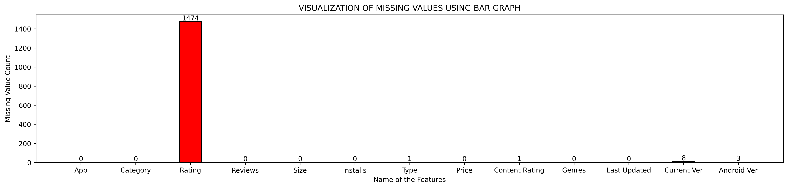
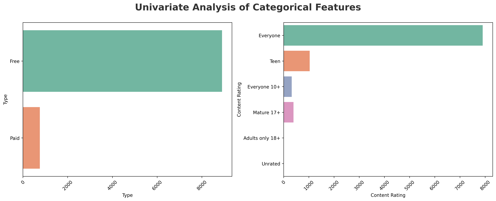
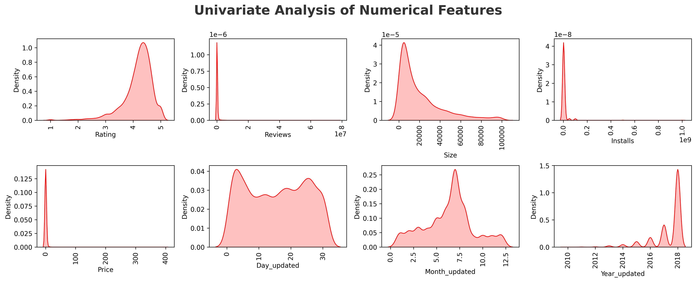
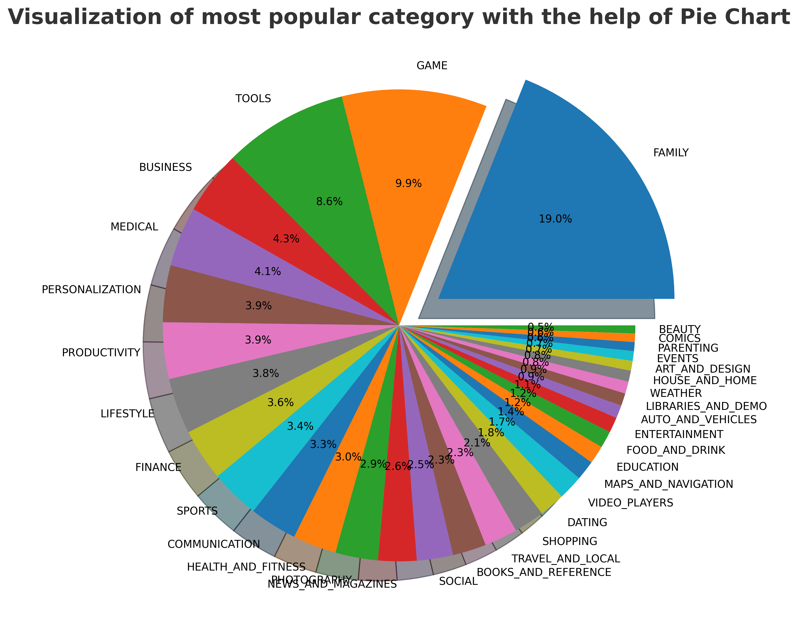
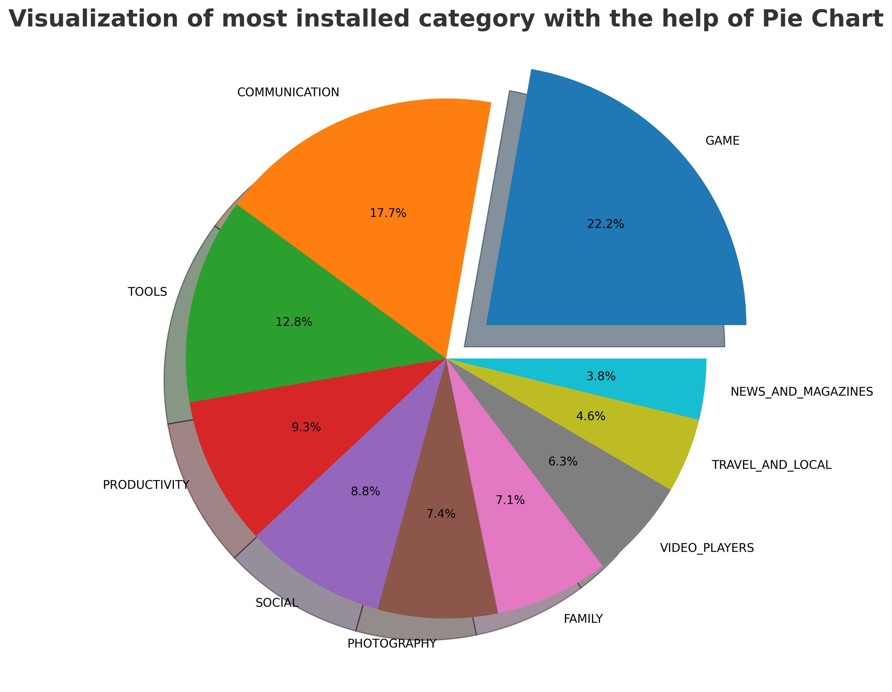
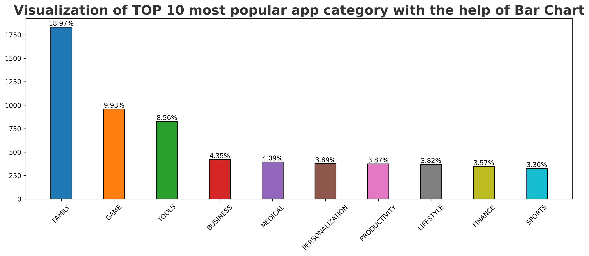

<div align="center">


# 📱 Google Play Store — Exploratory Data Analysis

> Uncovering what makes Android apps popular, profitable, and widely installed across 34 categories and 10,000+ apps.

</div>

---

## 📌 Overview

This project applies **Exploratory Data Analysis (EDA)** and **Feature Engineering** to the Google Play Store dataset — one of the most referenced open datasets for understanding the Android app ecosystem.

The goal is to go beyond surface-level charts and answer **real business questions**:
- Which categories are flooded with apps but starved of downloads?
- What does the rating distribution *actually* tell us about user behavior?
- Are paid apps a dying model, or do they hold a niche?
- What separates the top-installed apps from the rest?

---

## 🗂 Project Structure

```
Google-Playstore-EDA/
│
├── 📓 EDA Google playstore DATA.ipynb   # Full analysis notebook
│
├── 📁 Google-Playstore-Data/
│   └── googleplaystore.csv              # Raw dataset (10,841 records × 14 features)
│
├── 📁 reports/                          # All generated visualizations (PNG)
│   ├── missing_value_analysis.png
│   ├── Univariate_Analysis_of_Categorical_Features.png
│   ├── Univariate_Analysis_of_Numerical_Features.png
│   ├── most_popular_categories.png
│   ├── Most_installed_categories.png
│   ├── app_installed_by_category.png
│   └── Tpo_10_popular_apps.png
│
├── requirements.txt
└── README.md
```

---

## 🛠 Tech Stack

| Tool | Role |
|---|---|
| `pandas` | Data loading, wrangling, and aggregation |
| `numpy` | Numerical transformations |
| `matplotlib` | Static charts — bar, pie, KDE |
| `seaborn` | Styled statistical visualizations |
| `plotly.express` | Interactive sunburst charts |

---

## 🧹 Data Cleaning Pipeline

The raw dataset had significant quality issues across multiple columns — a realistic reflection of scraped, production-scale data.

| Column | Problem | Fix Applied |
|---|---|---|
| `Reviews` | Corrupted row (`"3.0M"`); stored as string | Removed bad row; cast to `int64` |
| `Size` | Mixed units (`19M`, `899k`, `Varies with device`) | Normalized to kilobytes; `Varies` → `NaN` |
| `Installs` | String brackets (`1,000,000+`) | Stripped `,` and `+`; cast to `int64` |
| `Price` | Dollar prefix (`$4.99`) | Stripped `$`; cast to `float64` |
| `Last Updated` | Non-standard date string (`7-Jan-18`) | Parsed with `pd.to_datetime()`; extracted Day / Month / Year |

**Deduplication:** 1,181 duplicate app entries were identified and removed, reducing the dataset from **10,841 → 9,659 unique apps**.

---

## 📊 Analysis & Visualizations

### 🔍 Missing Value Analysis

Understanding data completeness before drawing any conclusions.



> `Rating` has the highest missingness at **13.6% (1,474 apps)** — the only column requiring deliberate handling strategy.

---

### 📐 Univariate Analysis — Categorical Features

Distribution of apps across Category, Type, Content Rating, and Genres.



> **FAMILY** dominates with **~19% of all apps** (1,832), nearly double the second-largest category (GAME at 9.93%). Over **92.6% of apps are free**, confirming that the in-app purchase model has become the Android norm.

---

### 📐 Univariate Analysis — Numerical Features

Distribution of Rating, Reviews, Size, Installs, and Price.



> Most numerical features are **right-skewed** — a small number of apps account for the vast majority of installs, reviews, and revenue. `Rating` is the exception, with a left-skewed cluster around **4.19 (mean)** and **4.30 (median)**.

---

### 🏆 Most Popular App Categories (by App Count)

Which categories are most represented on the Play Store?



| Rank | Category | App Count | Share |
|---|---|---|---|
| 1 | FAMILY | 1,832 | 18.97% |
| 2 | GAME | 959 | 9.93% |
| 3 | TOOLS | 827 | 8.56% |
| 4 | BUSINESS | 420 | 4.35% |
| 5 | MEDICAL | 395 | 4.09% |

---

### 📥 Most Installed Categories (by Total Installs)

Volume of apps ≠ volume of downloads. Here's where users actually spend their time.



| Rank | Category | Total Installs |
|---|---|---|
| 🥇 | GAME | ~13.9 Billion |
| 🥈 | COMMUNICATION | ~11.0 Billion |
| 🥉 | TOOLS | ~8.0 Billion |
| 4 | PRODUCTIVITY | ~5.8 Billion |
| 5 | SOCIAL | ~5.5 Billion |

> **FAMILY has the most apps but GAME wins installs by a wide margin** — indicating far higher per-app install rates in gaming than any other category.

---

### 📦 Installs Distribution by Category

A per-category breakdown showing install concentration and spread.


> GAME and COMMUNICATION show the widest install variance — a handful of blockbuster apps pull the category average far above the median, while most apps in these categories remain relatively obscure.

---

### 🎮 Top 10 Most Installed Apps

The outright leaders in download count across the entire dataset.



> All top-installed apps cleared **100,000,000+ installs**. Titles like *Talking Ginger*, *Bitmoji*, and *Where's My Water?* dominate the FAMILY category — casual, wide-audience apps with strong retention loops.

---

## 💡 Key Insights & Conclusions

### 1. 📊 Volume ≠ Popularity
The FAMILY category has the most apps but is **not** the top-installed category. GAME category, with fewer apps, generates nearly **3× more total installs** — underscoring that category saturation doesn't translate to user demand.

### 2. 💸 Free Apps Have Won the Market
**92.6% of apps are free.** Paid apps are a small niche ($0.99–$2.99 being the dominant price points), suggesting that monetization has shifted entirely to in-app purchases, subscriptions, and ads.

### 3. ⭐ Ratings Are Optimistically Skewed
With a **mean of 4.19** and **271 apps rated 5.0**, the platform trends toward high ratings across the board. This likely reflects survivorship bias (low-rated apps get delisted) and potential review inflation rather than universal quality.

### 4. 📡 Communication & Social Punch Above Their Weight
These categories rank 2nd and 5th in installs despite being far down the list by app count — driven by a few mega-apps (WhatsApp, Messenger, Instagram) that individually account for billions of installs.

### 5. 🧼 Real Data Is Messy
Five key columns required non-trivial type conversion and cleaning. This is a practical reminder that analytical pipelines must handle inconsistent formats, corrupted entries, and missing values before any insight can be trusted.

### 6. 🎯 Audience is Overwhelmingly Broad
**~80% of apps target "Everyone"** — reflecting the Play Store's strategy of maintaining a family-friendly ecosystem. Teen and Mature content is a distant minority.

---

## ⚙️ How to Run

**1. Clone the repository**
```bash
git clone https://github.com/your-username/Google-Playstore-EDA.git
cd Google-Playstore-EDA
```

**2. Install dependencies**
```bash
pip install -r requirements.txt
```

**3. Launch the notebook**
```bash
jupyter notebook "EDA Google playstore DATA.ipynb"
```

> The notebook expects the dataset at `Google-Playstore-Data/googleplaystore.csv`. Run all cells top-to-bottom for a full reproducible analysis.

---

## 📦 Dataset

| Property | Value |
|---|---|
| Source | Google Play Store (scraped, open-source) |
| Records | 10,841 rows (9,659 after deduplication) |
| Features | 14 raw → 16 after feature engineering |
| Format | CSV |
| Size | ~1.27 MB |

> **Note:** This is a historical snapshot. It does not reflect current Play Store listings or rankings.

---

## 🧩 Feature Engineering

Three temporal features were extracted from `Last Updated` to enable time-based trend analysis:

| Feature | Description |
|---|---|
| `Day_updated` | Day of the month the app was last updated |
| `Month_updated` | Month of last update (enables seasonality analysis) |
| `Year_updated` | Year of last update (enables recency vs. rating correlation) |

---

## 📄 License

This project is licensed under the [MIT License](LICENSE).

---

<div align="center">

Made with 🐍 Python · 📓 Jupyter · 📊 Seaborn · 🌐 Plotly

*If this project helped you, consider giving it a ⭐ on GitHub!*

</div>
