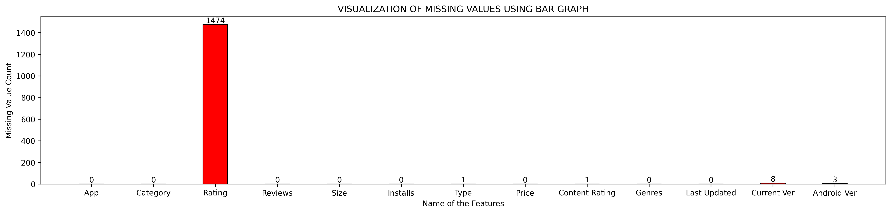
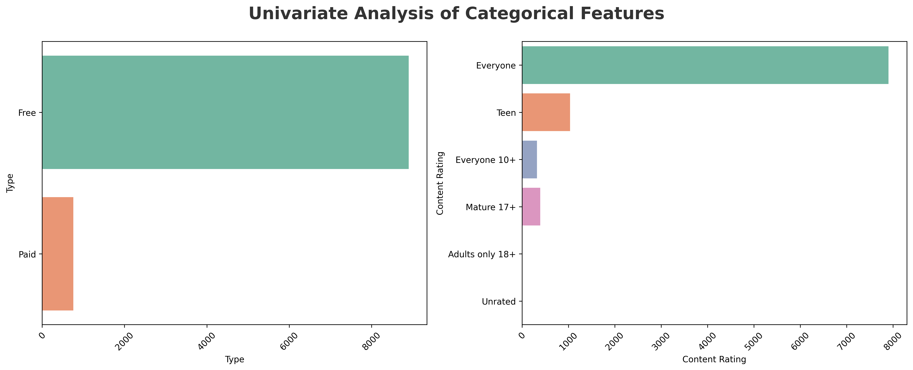
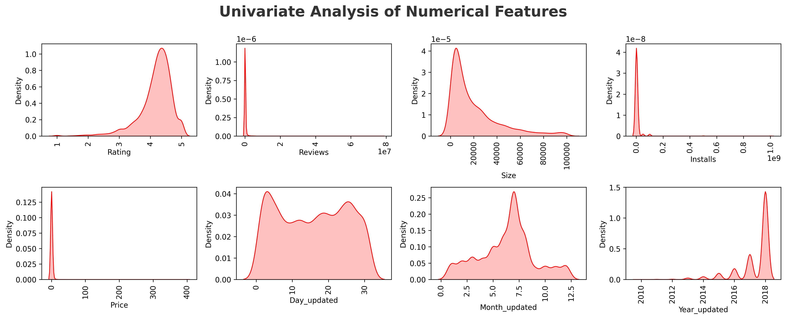
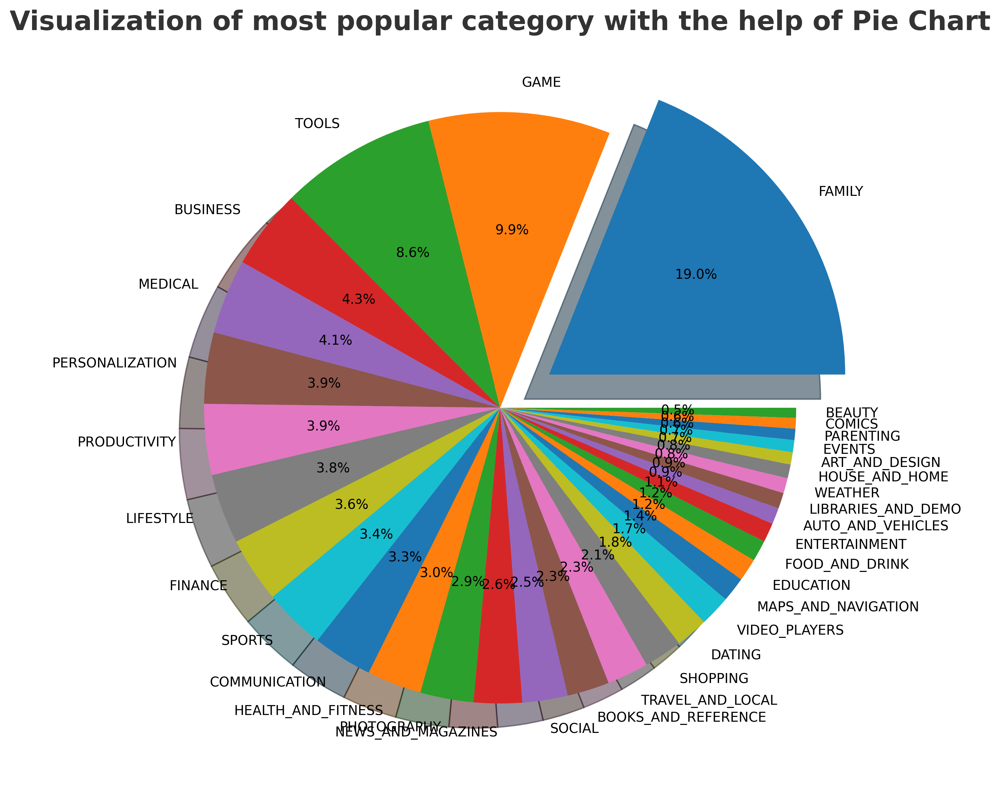
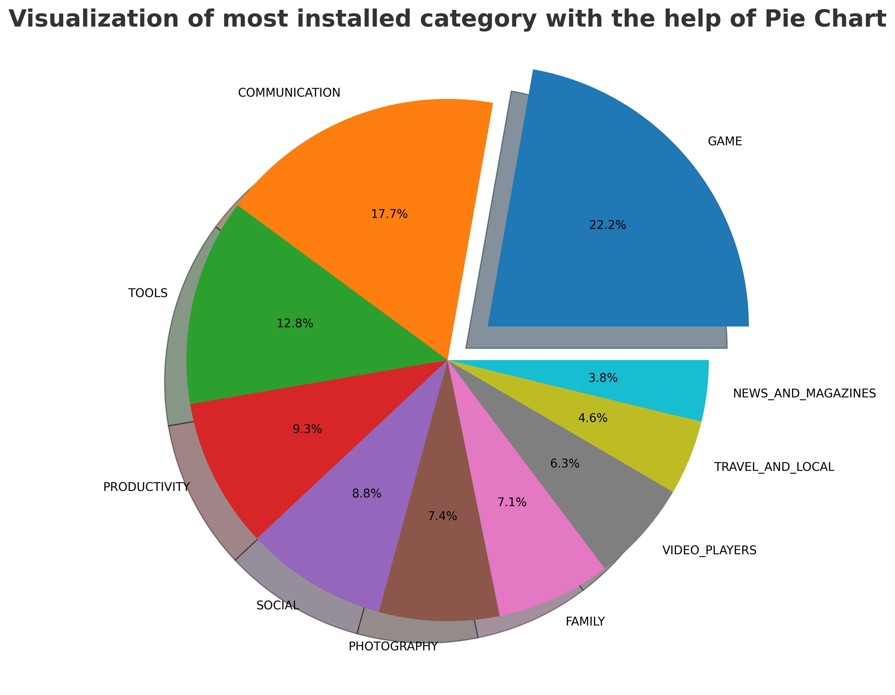
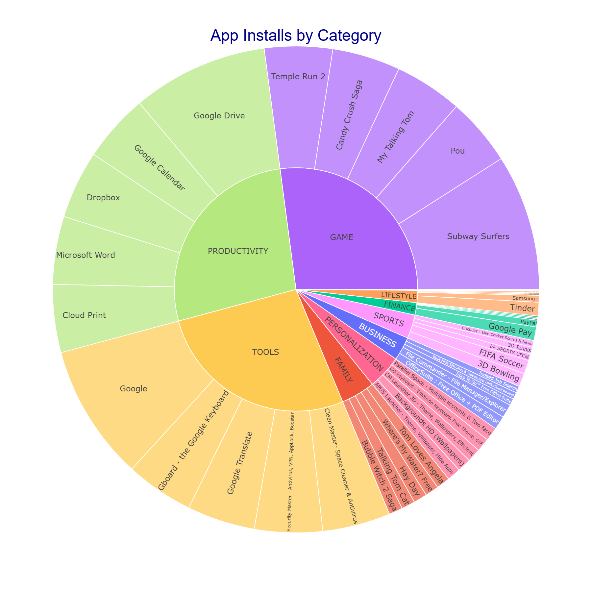
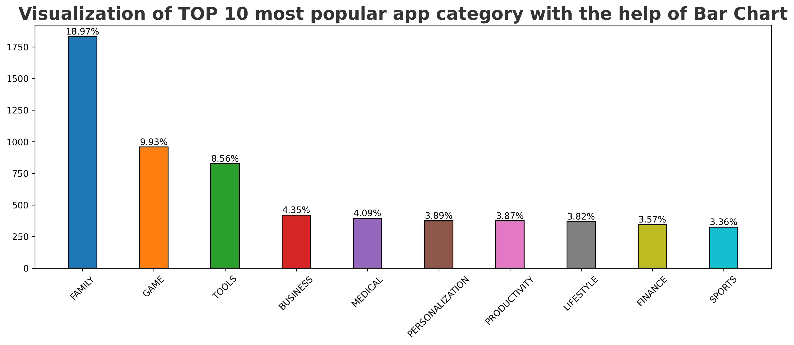

<div align="center">


# Google Play Store — EDA & Predictive Modelling

**End-to-end data science project:** exploratory analysis, automated ETL pipeline, machine learning models, and a deployable REST API — all on 10,000+ Android apps across 34 categories.

</div>

---

## Table of Contents

- [Project Overview](#project-overview)
- [Live Demo & API](#live-demo--api)
- [Project Structure](#project-structure)
- [Tech Stack](#tech-stack)
- [Data Pipeline](#data-pipeline)
- [Exploratory Data Analysis](#exploratory-data-analysis)
- [Machine Learning Models](#machine-learning-models)
- [Key Insights](#key-insights)
- [Getting Started](#getting-started)
- [Dataset](#dataset)
- [License](#license)

---

## Project Overview

This project delivers a **full data science lifecycle** on the Google Play Store dataset — one of the most widely referenced open datasets for understanding the Android app ecosystem.

It goes beyond surface-level charts to answer concrete business questions:

- Which categories are flooded with apps but starved of downloads?
- What does the rating distribution actually tell us about user behaviour?
- Are paid apps a dying model, or do they hold a niche?
- Can we predict an app's rating and commercial success from available signals?

The deliverable is not just a notebook — it's a **production-style project** with a modular ETL pipeline, trained ML models, MLflow experiment tracking, SQLite persistence, and a FastAPI endpoint ready for deployment.

---

## Live Demo & API

Once running locally, the FastAPI application exposes two endpoints:

| Method | Endpoint | Description |
|--------|----------|-------------|
| `POST` | `/train` | Triggers the full data pipeline and retrains both models |
| `GET` | `/predict?reviews=<n>&installs=<n>` | Returns predicted rating and success classification |

Interactive API docs are available at `http://localhost:8000/docs` (Swagger UI) after launch.

---

## Project Structure

```
Google-Playstore-EDA/
│
├── 📓 Notebooks/
│   ├── EDA Google playstore DATA.ipynb     # Full analysis notebook
│   └── reports/                            # Generated visualisations (PNG)
│       ├── missing_value_analysis.png
│       ├── Univariate_Analysis_of_Categorical_Features.png
│       ├── Univariate_Analysis_of_Numerical_Features.png
│       ├── most_popular_categories.png
│       ├── Most_installed_categories.png
│       ├── app_installed_by_category.png
│       └── Tpo_10_popular_apps.png
│
├── 📁 data/
│   ├── raw/googleplaystore.csv             # Source dataset (10,841 records × 14 features)
│   └── processed/                          # clean.csv and processed.csv outputs
│
├── 📁 pipeline/                            # Modular ETL pipeline
│   ├── ingestion.py                        # Data loading
│   ├── cleaning.py                         # Type casting, deduplication
│   ├── validation.py                       # Schema & constraint checks
│   ├── transformation.py                   # Feature engineering
│   ├── model.py                            # Model training & MLflow logging
│   ├── reporting.py                        # Chart generation
│   └── pipeline.py                         # Orchestrator
│
├── 📁 artifacts/
│   └── models/
│       ├── rating_model.pkl                # RandomForest regressor
│       └── success_model.pkl               # RandomForest classifier
│
├── 📁 utils/
│   ├── config.py
│   ├── db.py                               # SQLite helper
│   └── logger.py
│
├── 📁 mlruns/                              # MLflow experiment tracking store
├── 📁 templates/index.html                 # Jinja2 template for web UI
├── 📁 db/database.db                       # SQLite database
├── 📁 logs/                                # Run logs
│
├── app.py                                  # Application entry point
├── api.py                                  # FastAPI routes
├── db_schema.sql
├── requirements.txt
├── .env.example
└── README.md
```

---

## Tech Stack

| Layer | Library / Tool | Purpose |
|-------|---------------|---------|
| Data | `pandas 2.0`, `numpy` | Wrangling, aggregation, type casting |
| Visualisation | `matplotlib`, `seaborn`, `plotly.express` | Static charts, KDE plots, interactive sunbursts |
| Machine Learning | `scikit-learn` | RandomForest regressor & classifier |
| Experiment Tracking | `MLflow` | Parameter logging, model registry, artefact storage |
| API | `FastAPI`, `uvicorn` | REST endpoints for training and inference |
| Persistence | `SQLite`, `joblib` | Processed data storage and model serialisation |
| Templating | `Jinja2` | Lightweight web UI |
| Logging | Custom `logger.py` | Structured run logs |

---

## Data Pipeline

The ETL pipeline is fully modular — each stage is a separate, independently testable Python module orchestrated by `pipeline.py`.

### Cleaning Steps

The raw dataset contained significant quality issues typical of scraped, production-scale data:

| Column | Problem | Fix Applied |
|--------|---------|-------------|
| `Reviews` | Corrupted row (`"3.0M"`); stored as string | Removed bad row; cast to `int64` |
| `Size` | Mixed units (`19M`, `899k`, `Varies with device`) | Normalised to kilobytes; `Varies` → `NaN` |
| `Installs` | String brackets (`1,000,000+`) | Stripped `,` and `+`; cast to `int64` |
| `Price` | Dollar prefix (`$4.99`) | Stripped `$`; cast to `float64` |
| `Last Updated` | Non-standard date string (`7-Jan-18`) | Parsed with `pd.to_datetime()`; extracted Day / Month / Year |

**Deduplication:** 1,181 duplicate entries removed — dataset reduced from **10,841 → 9,659 unique apps**.

### Feature Engineering

Three temporal features were derived from `Last Updated` to support time-based trend analysis:

| Feature | Description |
|---------|-------------|
| `Day_updated` | Day of month the app was last updated |
| `Month_updated` | Month of update (enables seasonality analysis) |
| `Year_updated` | Year of update (enables recency vs. rating correlation) |

---

## Exploratory Data Analysis

### Missing Value Analysis



`Rating` has the highest missingness at **13.6% (1,474 apps)** — the only column requiring a deliberate imputation or exclusion strategy before modelling.

---

### Univariate Analysis — Categorical Features



**FAMILY** dominates with ~19% of all apps (1,832), nearly double the second-largest category (GAME at 9.93%). Over **92.6% of apps are free**, confirming the in-app purchase model has become the Android standard.

---

### Univariate Analysis — Numerical Features



Most numerical features are **right-skewed** — a small number of breakout apps account for the vast majority of installs, reviews, and revenue. `Rating` is the exception, clustering around a mean of **4.19** with a left-skewed distribution.

---

### Most Popular Categories (by App Count)



| Rank | Category | App Count | Share |
|------|----------|-----------|-------|
| 1 | FAMILY | 1,832 | 18.97% |
| 2 | GAME | 959 | 9.93% |
| 3 | TOOLS | 827 | 8.56% |
| 4 | BUSINESS | 420 | 4.35% |
| 5 | MEDICAL | 395 | 4.09% |

---

### Most Installed Categories (by Total Installs)



| Rank | Category | Total Installs |
|------|----------|----------------|
| 🥇 | GAME | ~13.9 Billion |
| 🥈 | COMMUNICATION | ~11.0 Billion |
| 🥉 | TOOLS | ~8.0 Billion |
| 4 | PRODUCTIVITY | ~5.8 Billion |
| 5 | SOCIAL | ~5.5 Billion |

**FAMILY has the most apps but GAME wins installs by a wide margin** — indicating far higher per-app install rates in gaming than any other category.

---

### Install Distribution by Category



GAME and COMMUNICATION show the widest install variance. A handful of blockbuster apps pull the category average far above the median, while most apps in these categories remain relatively obscure.

---

### Top 10 Most Installed Apps



All top-installed apps cleared **100,000,000+ installs**. Titles like *Talking Ginger*, *Bitmoji*, and *Where's My Water?* dominate the FAMILY category — casual, wide-audience apps with strong retention loops.

---

## Machine Learning Models

Two models are trained and tracked via MLflow:

| Model | Type | Target | Algorithm |
|-------|------|--------|-----------|
| `rating_model.pkl` | Regression | Predict app `Rating` | RandomForestRegressor |
| `success_model.pkl` | Classification | Predict `Success` (Installs > 100K) | RandomForestClassifier |

**Features used:** `Reviews`, `Installs`

**Evaluation metrics** are logged to MLflow on every training run:
- Regression: **RMSE**
- Classification: **Accuracy**, **Confusion Matrix**

Models are serialised with `joblib` and stored in `artifacts/models/`. All runs are tracked in the local `mlruns/` store and can be viewed with the MLflow UI.

```bash
mlflow ui
# Open http://localhost:5000
```

---

## Key Insights

**1. Volume ≠ Popularity**
The FAMILY category has the most apps but is not the top-installed category. GAME generates nearly 3× more total installs with fewer apps — category saturation does not translate to user demand.

**2. Free Apps Have Won the Market**
92.6% of apps are free. Paid apps occupy a small niche ($0.99–$2.99 being the dominant price points), indicating that monetisation has shifted entirely to in-app purchases, subscriptions, and advertising.

**3. Ratings Are Optimistically Skewed**
With a mean of 4.19 and 271 apps rated 5.0, the platform trends high. This likely reflects survivorship bias (low-rated apps get delisted) and review inflation rather than universal quality.

**4. Communication & Social Punch Above Their Weight**
These categories rank 2nd and 5th in installs despite sitting far down the list by app count — driven by a handful of mega-apps (WhatsApp, Messenger, Instagram) that individually account for billions of installs.

**5. Real Data Is Messy**
Five key columns required non-trivial type conversion and cleaning. This is a practical reminder that analytical pipelines must handle inconsistent formats, corrupted entries, and missing values before any insight can be trusted.

**6. Audience Is Overwhelmingly Broad**
~80% of apps target "Everyone", reflecting the Play Store's strategy of maintaining a family-friendly ecosystem. Teen and Mature content is a distant minority.

---

## Getting Started

### Prerequisites

- Python 3.10+
- `pip`

### Installation

**1. Clone the repository**
```bash
git clone https://github.com/your-username/Google-Playstore-EDA.git
cd Google-Playstore-EDA
```

**2. Set up environment variables**
```bash
cp .env.example .env
# Edit .env as needed
```

**3. Install dependencies**
```bash
pip install -r requirements.txt
```

### Run Options

**Option A — Jupyter Notebook (EDA only)**
```bash
jupyter notebook "Notebooks/EDA Google playstore DATA.ipynb"
```
Run all cells top-to-bottom for the full reproducible analysis.

**Option B — Full pipeline + API**
```bash
# Run the data pipeline and train models
python app.py

# Or launch the API directly (models must already exist in artifacts/models/)
uvicorn api:app --reload
```
API docs available at `http://localhost:8000/docs`.

**Option C — MLflow UI**
```bash
mlflow ui
# Open http://localhost:5000 to browse experiment runs
```

---

## Dataset

| Property | Value |
|----------|-------|
| Source | Google Play Store (scraped, open-source) |
| Records | 10,841 rows (9,659 after deduplication) |
| Features | 14 raw → 16 after feature engineering |
| Format | CSV |
| Size | ~1.27 MB |

> **Note:** This is a historical snapshot and does not reflect current Play Store listings or rankings.

---

## License

This project is licensed under the [MIT License](LICENSE).

---

<div align="center">

Built with Python · Jupyter · scikit-learn · FastAPI · MLflow

*If this project was useful, consider giving it a ⭐ on GitHub.*

</div>
